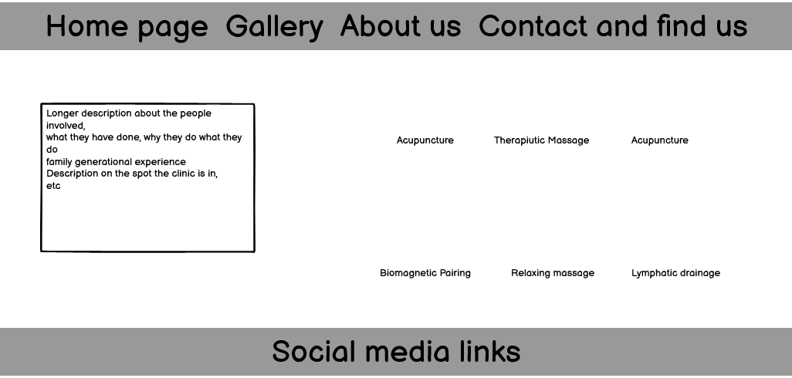
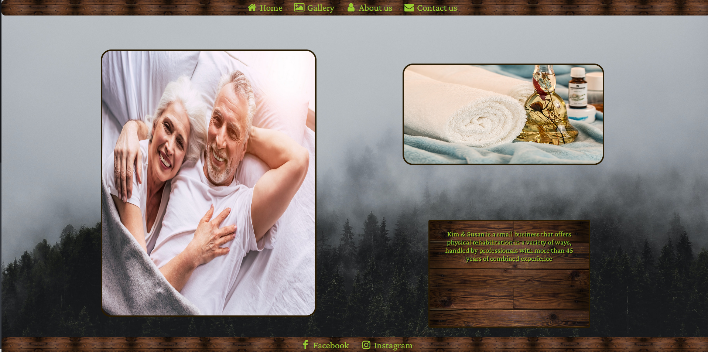

# KimOchSusan
(Developer: David Österholm Martínez)

[Live webpage](https://domesse.github.io/CI_PP1_KimOchSusan/)

## Table of Content

1. [Project Goals](#project-goals)
    1. [User Goals](#user-goals)
    2. [Site Owner Goals](#site-owner-goals)
2. [User Experience](#user-experience)
    1. [Target Audience](#target-audience)
    2. [User Requirements and Expectations](#user-requrements-and-expectations)
    3. [User Stories](#user-stories)
3. [Design](#design)
    1. [Design Choices](#design-choices)
    2. [Color](#colours)
    3. [Fonts](#fonts)
    4. [Structure](#structure)
    5. [Wireframes](#wireframes)
4. [Technologies Used](#technologies-used)
    1. [Languages](#languages)
    2. [Frameworks & Tools](#frameworks-&-tools)
5. [Features](#features)
6. [Testing](#validation)
    1. [HTML Validation](#HTML-validation)
    2. [CSS Validation](#CSS-validation)
    3. [Accessibility](#accessibility)
    4. [Performance](#performance)
    5. [Device testing](#performing-tests-on-various-devices)
    6. [Browser compatibility](#browser-compatibility)
7. [Deployment](#deployment)
8. [Credits](#credits)
9. [Acknowledgements](#acknowledgements)
10. [What would I've done differently](#what-would-i've-dpme-differently)

## Project Goals 

### User Goals
- Finding a clinic with experience.
- See what the different treatment options are.
- Find information about the people that work there.
- Find the location of the clinic.

### Site Owner Goals
- Attract new customers.
- Raise awareness for the treatment options.
- Provide an easy channel for customers to contact the busines.
- Create good emotions and a warm feeling on site visitors.

## User Experience

### Target Audience
- People involved in high intensity sports looking for great recovery.
- People with chronic issues that need constant maintenance.
- People interested in trying out physiotherapy for the first time
- People that are involved in similar work who need help with their own recovery.

### User Requirements and Expectations

- Intuitive navigation.
- Information for newcomers and experienced users alike.
- Links that work properly.
- Responsive and pleasing design.
- Some way to contact the business.
- Easily digestible content.
- Accessibility for all.

### User Stories

1. I want to see a clear homepage that doesn't overwhelm me.
2. I want to feel warm and positive emotions when looking at the webpage.
3. I want to easily understand what the page and the people behind it are about.
4. I want to navigate easily and quickly through the pages.
5. I wanna peek at the inside of their clinic.
6. I want to access contact information.
7. I want to dive a little bit deeper on what each therapy type entails.
8. I want to know where the business is located
9. I want to provide my information so the business owners can contact me

## Design

### Design Choices
The webpage was designed with a homely, small business, family owned feeling.
Ideally, the page evokes thoughts of the beatiful nordic nature.

### Color
The color scheme was inspired by nordic nature.

### Fonts
The whole page is done with Crimson Pro, followed by Helvetica and sans-serif as backups.

### Structure
The page is structured in a well know, recognizable, user friendly, and easy to learn way. Upon arriving to the website the user sees a familiar type of navigation bar with the restaurant logo on the left side and the navigation links to the right. 
The website consists of four separate pages: 
- A homepage, with a few photos of the people involved and a short introduction.
- An about us page, with some extra info on the people involved and a bunch of links to deepen the users understanding of the treatment options.
- A gallery, with a few images to give the user an idea of what to expect.
- A contact page with a form to provide contact information and a map.

### Wireframes

Home

Gallery

About us

Contact us

## Technologies Used

### Languages
- HTML
- CSS

### Frameworks & Tools
- Git
- GitHub
- Gitpod
- Font Awesome
- Balsamiq
- Google Fonts

## Features
The page consists of four pages and nine features

### Navigation Bar
- Featured on all four pages.
- The navbar is fully responsive and becomes vertical when the screen size is small enough.
- The links have a nice highlight to show what you are hovering over, makes it easier to understand that they are interactive links.
- User stories covered: 4

### Home Page
- Allowes users to see what meal-deal is available for the upcoming Sunday
- User stories covered: 1, 2

### Footer
- Featured on all four pages.
- It also contains links to the business owners social media.
- User stories covered: 3

### About Us
- Gives a description of the restaurant and its facilities with a image of the front of the building on the right side
- User stories covered: 3

### Contact us
- Features a few reviews left by the restaurants customers on social media
- User stories covered: 6

### Gallery
- Imagery of the restaurant arranged in a grid
- User stories covered: 5

### Contact Form
- A way for user to provide feedback
- User stories covered: 9

### Map
- There is an iFrame with the business physical location.
- User stories covered: 8

### Treatment Info board
- Provides the user with information about the restaurant including address, phone number, email, and the name of the owner
- User stories covered: 7

## Validation

### HTML Validation
The W3C Markup Validation Service was used to validate the HTML of the website. All pages pass with no errors and no warnings.

Home

Gallery

About us

Contact us

### CSS Validation
The W3C Jigsaw CSS Validation Service was used to validate the CSS of the website.
No errors

Direct input

Result

### Accessibility
WAVE Web Accessibility Evaluation Tools was used to check accesibility. No errors.

Accessibility

### Performance 
Google Lighthouse in Google Chrome Developer Tools was used to test the performance of the website. 

Performance

### Performing tests on various devices 
The website was tested on the following devices:
- Lenovo Legion (Laptop).
- Iphone 5 SE.

### Browser compatibility
- Google Chrome.
- Mozilla Firefox.
- Microsoft Edge.

## Deployment
The website was deployed using GitHub Pages by following these steps:

1. In the GitHub repository navigate to the Settings tab
2. On the left hand menu select Pages
3. For the source select Branch: master
4. After the webpage refreshes automaticaly you will se a ribbon on the top saying: "Your site is published at https://4n4ru.github.io/CI_MS1_BodelschwingherHof/"

You can for fork the repository by following these steps:

1. Log into your GitHub account and find the repository.
2. Click 'Fork' (last button on the top right of the repository page).
3. You will then have a copy of the repository in your own GitHub account.

You can clone the repository by following these steps:

1. Go to the GitHub repository 
2. Locate the Code button above the list of files and click it 
3. Select if you prefere to clone using HTTPS, SSH, or Github CLI and click the copy button to copy the URL to your clipboard
4. Open Git Bash
5. Change the current working directory to the one where you want the cloned directory
6. Type git clone and paste the URL from the clipboard ($ git clone https://github.com/YOUR-USERNAME/YOUR-REPOSITORY)
7. Press Enter to create your local clone.

## Credits

### Media
- [Pixabay](https://www.pexels.com/photo/brown-wooden-board-301378/)
- [Eberhard Grossgasteiger](https://www.pexels.com/search/eberhard%20grossgasteiger/)
- [User 13107714](https://pixabay.com/photos/senior-couple-bed-happy-4723737/)
- [stevepb](https://pixabay.com/photos/massage-therapy-essential-oils-1612308/)
- [whitesession](https://pixabay.com/photos/massage-shoulder-human-relaxation-2768833/)
- [rythmuswege](https://pixabay.com/photos/wellness-massage-relax-relaxing-285587/)
- [spabyelenda](https://pixabay.com/photos/reception-spa-registration-clinic-5078879/)
- [ha11ok](https://pixabay.com/photos/budha-sculpture-buddha-statue-4188734/)
- [Sofia_Shultz_Photography](https://pixabay.com/photos/older-couple-grandfather-grandmother-6299322/)
- [Enging_Akyurt](https://pixabay.com/photos/abstract-futuristic-lights-dream-1838153/)
- [SocialButterflyMMG](https://pixabay.com/photos/stones-spa-massage-relax-salon-3184610/)

## Acknowledgements
I would like to take the opportunity to thank:
- Mr Mo Shami, my mentor, for his feedback, support and great attitude despite my challenges.
- My friend David Caro Claromonte for helping me out when I got stuck with something, explaining iFrames to me, and overall feedback.
- Susan Rönnbäck and Joacim Österholm for the website idea, they are the owners of the clinic.
- Mo Shami's old students, who I learned immensely from.
- Font-awesome for the icons I used in my website.

## What would I've done differently

- If I had done this project again, I would've worked a lot more on the responsiveness of the webpage on different screen sizes.
- I would've made and added a logo to the webpage and I would've added a specific icon for the website.
- I would've made a more thorough readme, ex. bugs section, more device testing, testing user stories, etc.
- I would've tried out bootstrap.
- I'd have ordered the CSS rulings better from the very beginning.